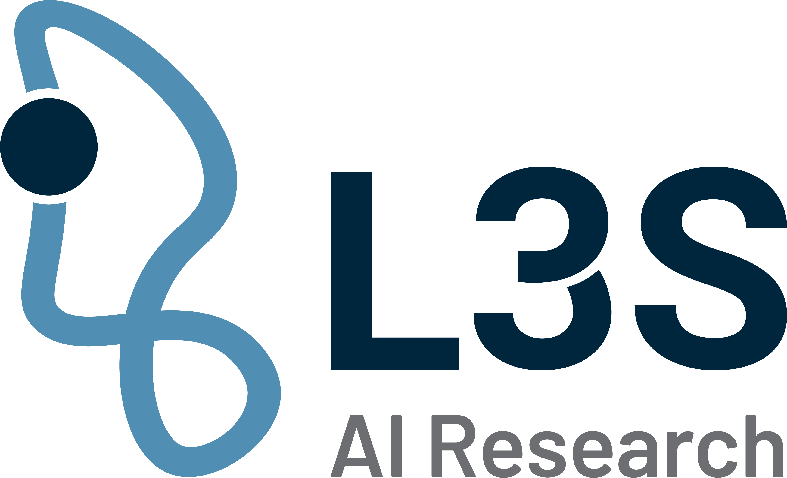
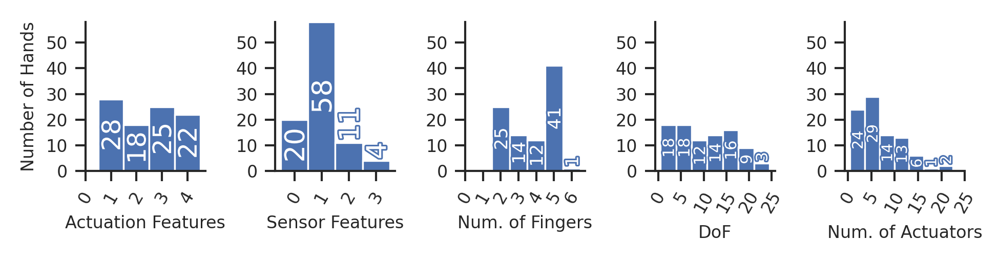
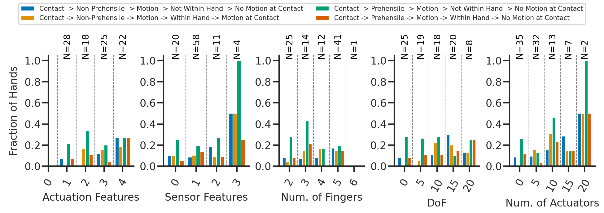
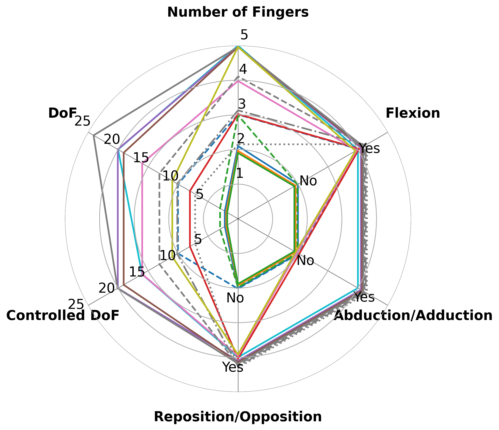
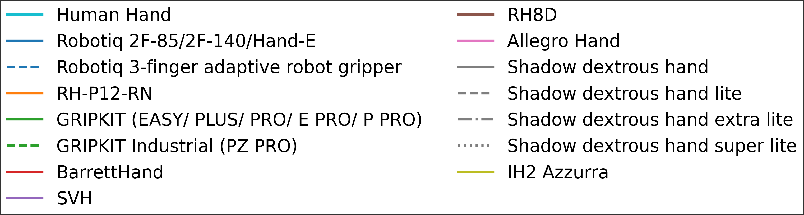
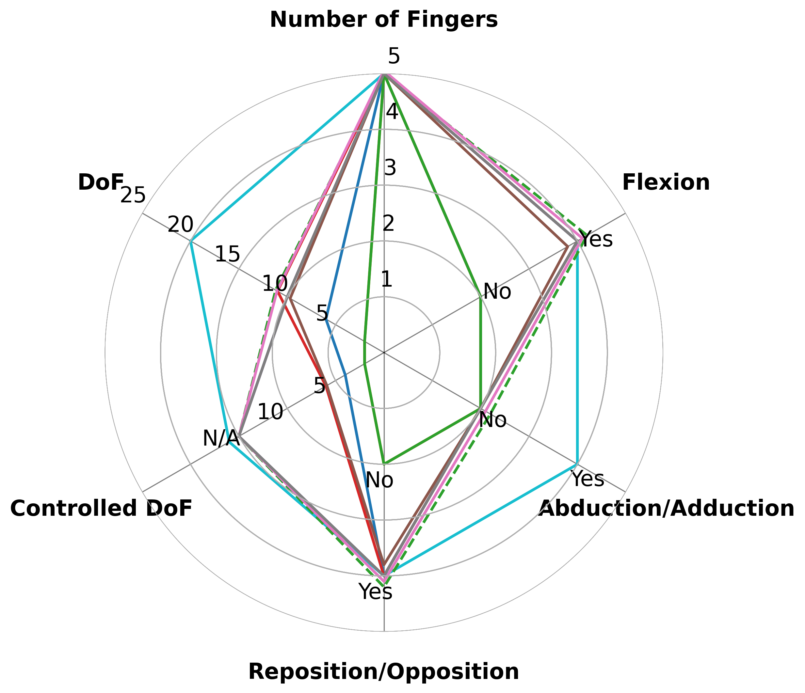
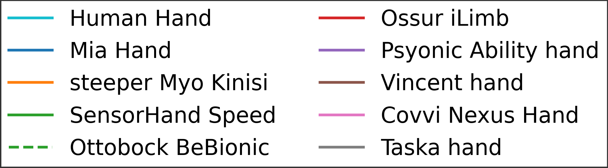
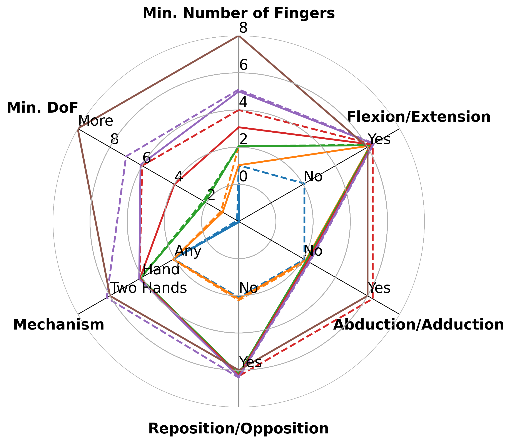
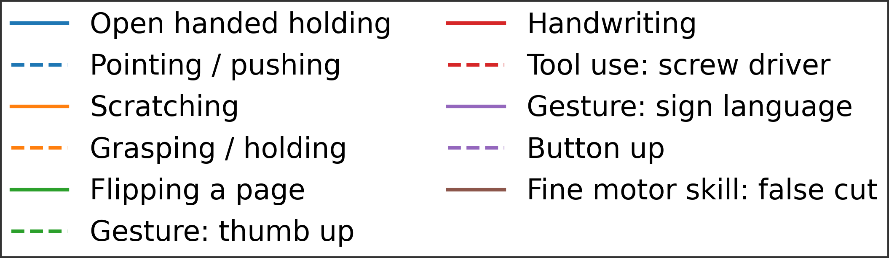

# Do Robots Really Need Anthropomorphic Hands?

Analysis code for the systematic literature review in:

> Fabisch, A., Zai El Amri, W., Singh, C. et al. Do Robots Really Need Anthropomorphic Hands? A Comparison of Human and Robotic Hands. J Intell Robot Syst 112, 73 (2026). https://doi.org/10.1007/s10846-026-02431-8

Abstract:

> Human manipulation skills represent a pinnacle of their voluntary motor functions, requiring the coordination of many degrees of freedom and processing of high-dimensional sensor input to achieve remarkable dexterity. Thus, we set out to answer whether the human hand, with its associated biomechanical properties, sensors, and control mechanisms, is an ideal that we should strive for in robotics. Do robots need anthropomorphic hands?
> We start by extracting characteristics of the human hand in terms of biomechanics and perception to compare them with currently commercially available robotic hands. From this comparison, we derive our research questions that connect manipulation system complexity to skill repertoire size and dexterity. We attempt to answer these with a systematic literature review, in which we analyze the manipulation capabilities demonstrated in 125 papers from 2019-2025.
> Although complex five-fingered hands are often considered the ultimate goal for robotic manipulators, they are not necessary for all tasks. We find that in-hand manipulation does not benefit from anthropomorphic hand design as simpler mechanisms are sufficient, but mechanism complexity correlates with the breadth of manipulation tasks a hand can perform. Sensor integration and intelligent manipulation strategies remain underexplored, which may be because of a misalignment with hand design: instead of replicating the number of fingers and degrees of freedom, focusing on robustness and softness would allow more intelligent control and learning to exploit environmental contacts and integrate more sensors. Finally, we argue for standardized evaluation criteria to enable systematic comparison of hand designs and manipulation systems.

 

Bibtex entry:

```bibtex
@article{Fabisch2026DoRobotsReally,
author={Alexander Fabisch and Wadhah Zai El Amri and Chandandeep Singh and Nicolás Navarro-Guerrero},
title={Do Robots Really Need Anthropomorphic Hands? A Comparison of Human and Robotic Hands},
journal={Journal of Intelligent \& Robotic Systems},
year={2026},
volume={112},
number={3},
pages={73},
doi={10.1007/s10846-026-02431-8}
}
```

## Repository layout

- `data/` — primary dataset and annotation documentation
  - `included articles.xlsx` — original data-entry spreadsheet
  - `README.md` — annotation process and column definitions
- `load_hands.py` — shared data loader used by all scripts
- `requirements.txt` — Python dependencies
- `crawlers/` — scripts that retrieved candidate papers from Google Scholar and IEEE Xplore (see `crawlers/README.md`)
- `descriptive/` — histograms of hand features and skill coverage (see `descriptive/README.md`)
- `correlation_analysis/` — statistical tests for RQ1–RQ5 (see `correlation_analysis/README.md`)
- `radar_plots/` — radar charts comparing hand mechanisms and skill requirements (see `radar_plots/README.md`)
- `manuscript/` — LaTeX source and figures
  - `figures/` — output directory for all generated plots

## Dataset

`data/Robotic_hands_Included_articles.csv` contains one row per included
paper-hand combination with the following columns:

- Bibliographic info: paper title, URL
- Hand identity: HandName
- Mechanism features: Num. of Fingers, DoF, Num. Actuators, Palm,
  Reposition/Opposition, Abduction/Adduction, Flexion/Extension
- Sensor features: Tactile Feedback, Kinesthetic Feedback, Visual Feedback
- Skill columns: one binary column per category in Dollar's (2014) taxonomy
  (15 categories), plus two numeric columns for in-hand manipulation DoF
  (categories 14 and 15)

See `data/README.md` for the full annotation process and column definitions.

`load_hands.py` loads and cleans this CSV: normalises hand names, converts
Yes/No strings to booleans, and handles special values.

## Setup

Python 3.12 is required.

```
pip install -r requirements.txt
```

## Running the analysis

To run everything in one go:

```
bash run_all.sh
```

This executes all steps in dependency order: data export → correlation analysis → figures.
Individual steps are documented below.

All scripts are designed to be run from this directory.

### Descriptive plots

```
python descriptive/plot_hand_feature_histogram.py
python descriptive/plot_percentage_histogram.py
```

#### Hand Features



#### Skill Repertoire Exploration



### Correlation analysis (RQ1-RQ5)

```
python correlation_analysis/compute_all_tests.py
python correlation_analysis/plot_correlation_skill_repertoire.py
python correlation_analysis/plot_extreme_cases_num_actuators.py
```

`compute_all_tests.py` must be run first; it writes
`correlation_analysis/results_continuous.csv` and
`correlation_analysis/results_binary.csv` which the plot scripts read.

To export the results as Markdown tables (for browsing on GitHub):

```
python correlation_analysis/results_to_markdown.py
```

Output: [`correlation_analysis/results.md`](correlation_analysis/results.md)

### Radar charts

```
python radar_plots/radar_robotic_seperated.py
python radar_plots/radar_prosthetic_seperated.py
python radar_plots/radar_skills_seperated.py
```

All output figures are written to `manuscript/figures/`.

#### Robotic Hands




#### Prosthetic Hands




#### Skills




## Funding

This work was supported by the European Commission under the Horizon 2020 framework program for Research and Innovation via the APRIL project (project number: 870142) and by the Vibro-Sense Project (project number: 03DPS1242A) funded by the Bundesministerium Forschung, Technologie und Raumfahrt (BMFTR) under the DATIpilot program. This work was partially supported by the German Federal Ministry of Research, Technology and Space (BMFTR) under the Robotics Institute Germany (RIG). Open Access funding provided by the Projekt DEAL (Open access agreement for Germany).
